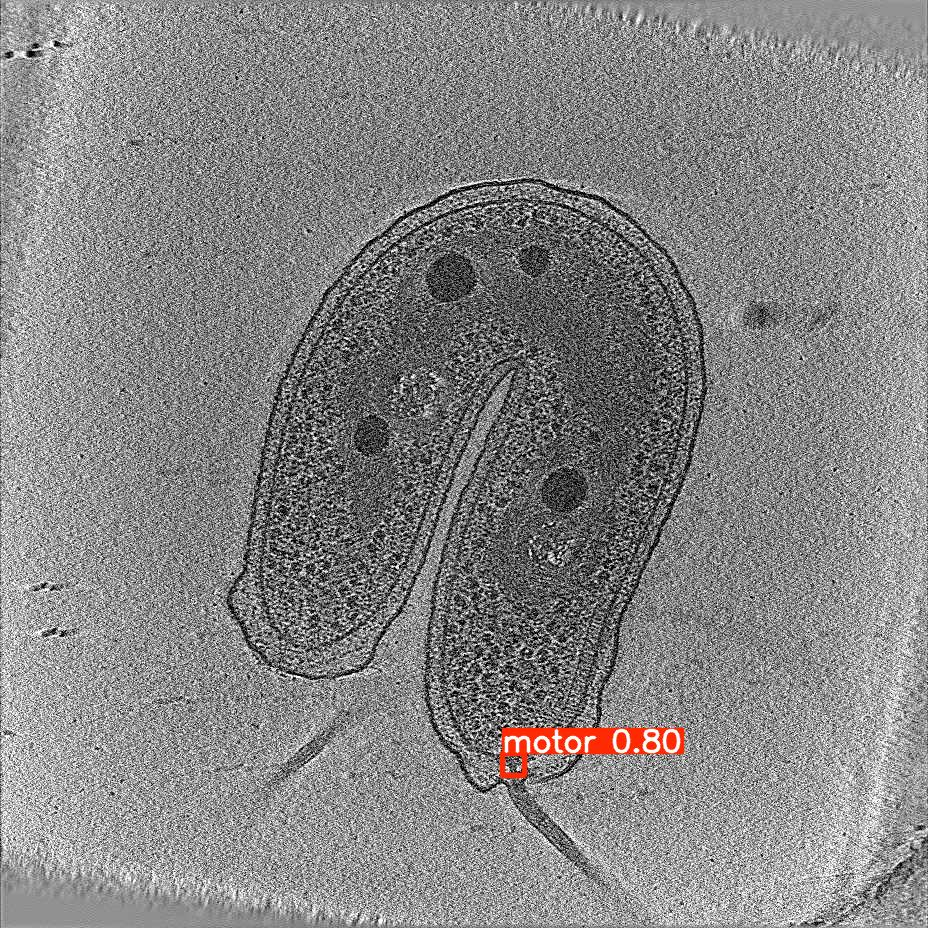
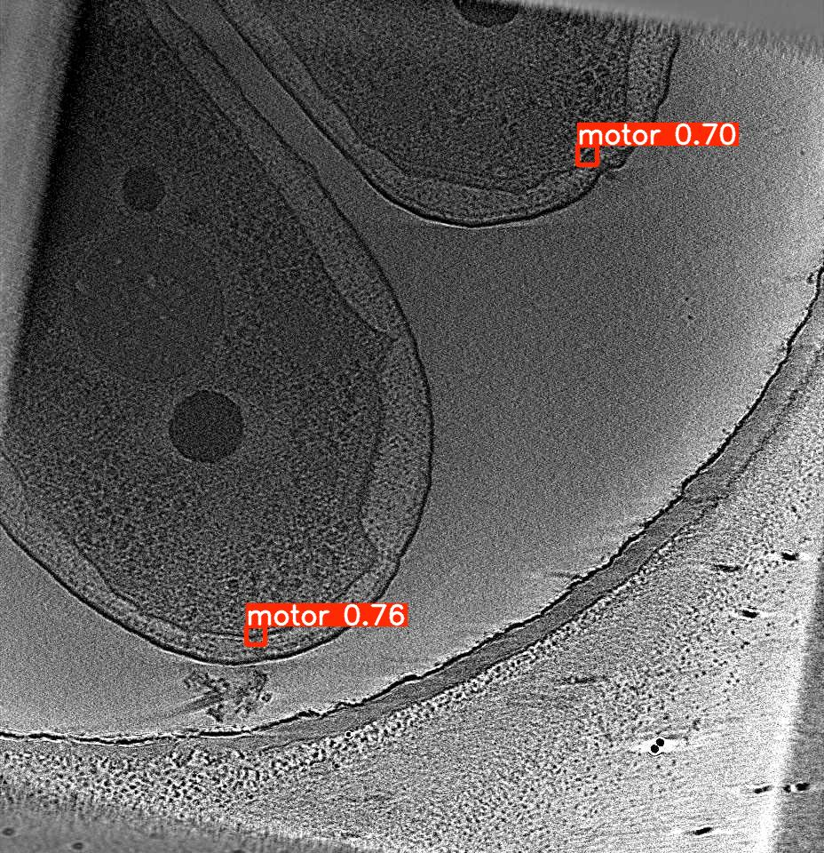
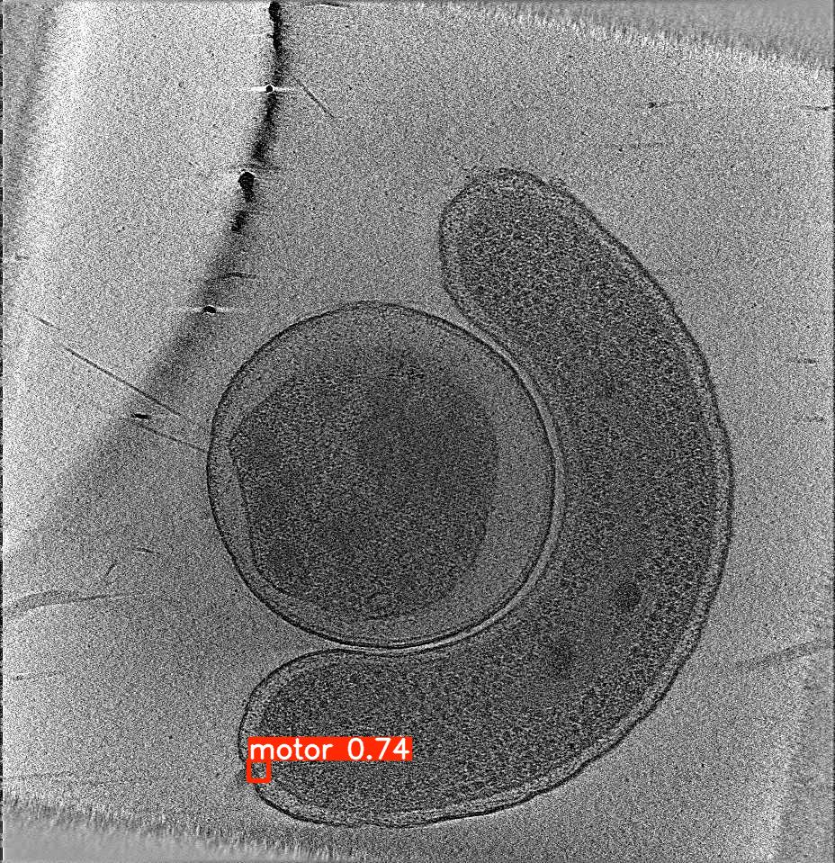
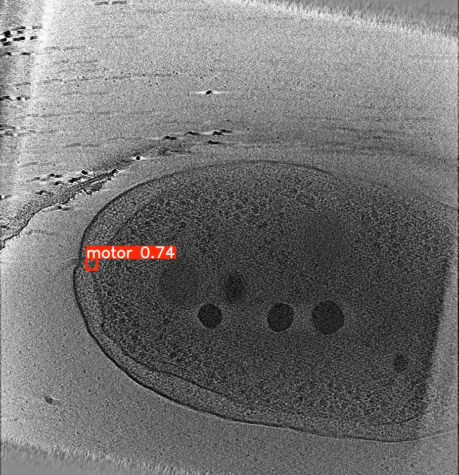
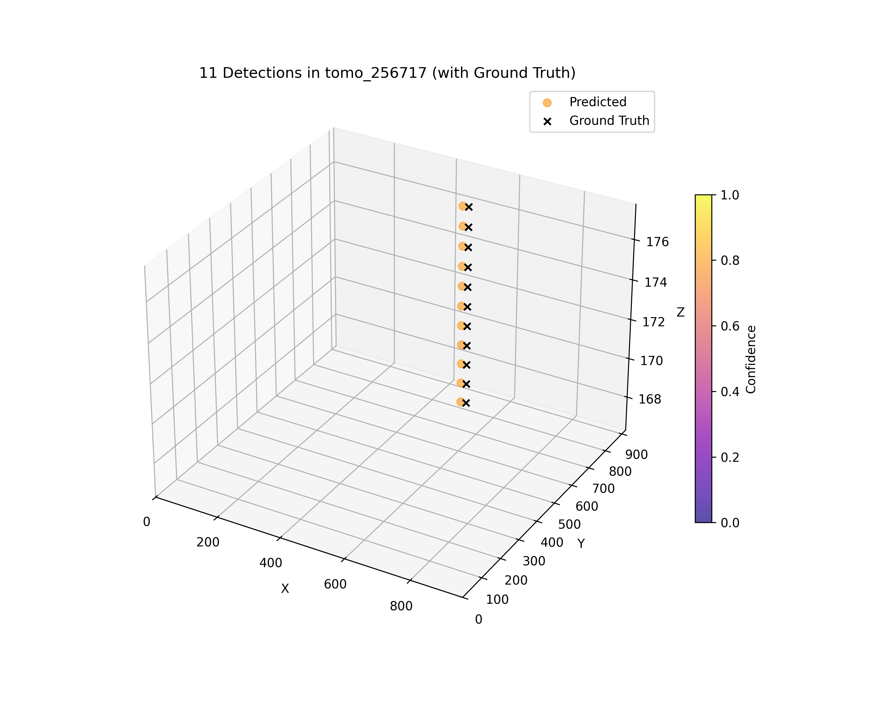
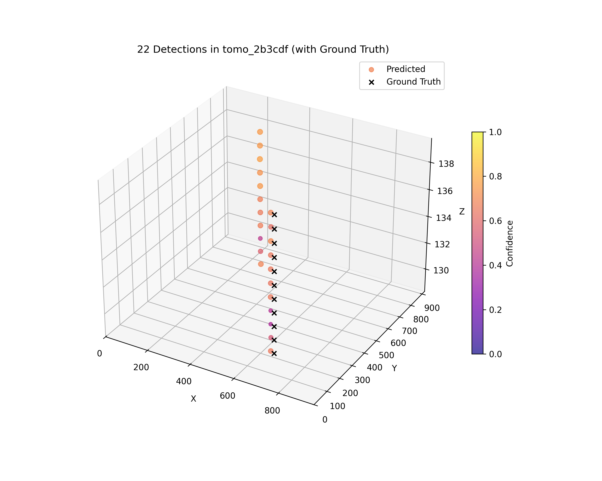
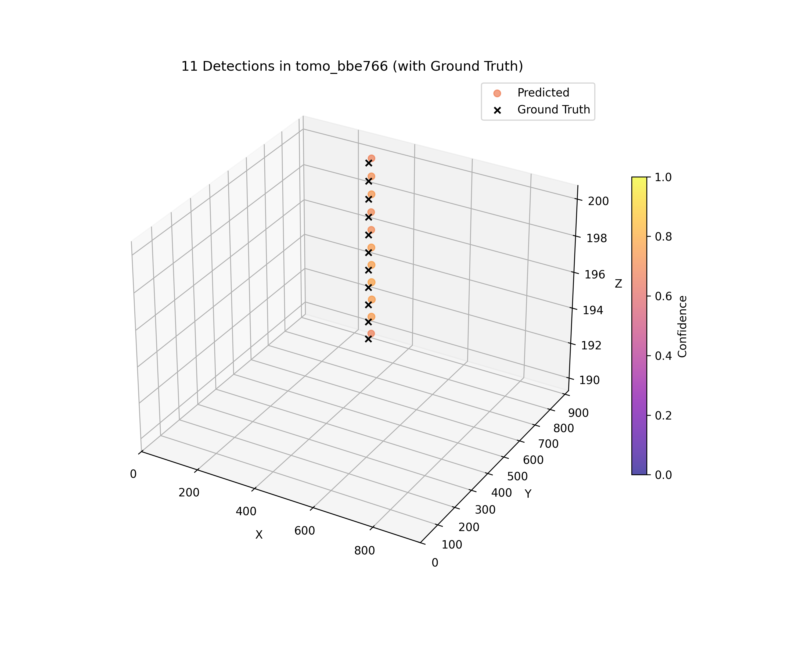
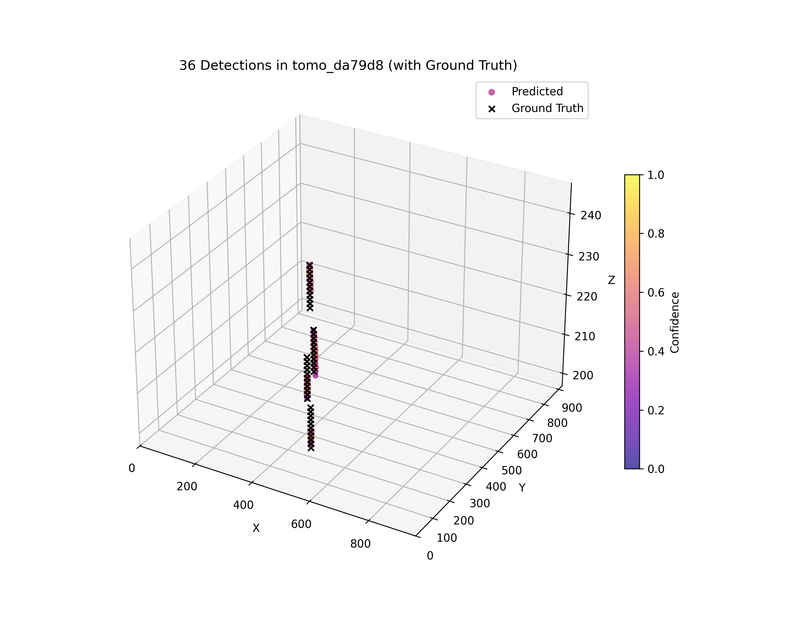

# Detection of Bacterial Flagellar Motors in Tomograms

## Table of Contents
- [Abstract](#abstract)
- [Repository Structure](#repository-structure)
- [Bigred Setup](#bigred-setup)
- [Results](#results)

## Abstract

Flagellar motors are important nanomachines in bacteria that drive cell motility and play a key role in understanding biological processes such as microbial behavior, drug development, and synthetic biology. While cryogenic electron tomography (cryo-ET) enables detailed 3D imaging of these motors, manually locating them across thousands of tomographic slices is time-consuming and prone to errors. We address the challenge of automating flagellar motor detection by leveraging the YOLO object detection framework. We benchmark multiple YOLOv8 and YOLOv9 variants on labeled cryo-ET slices, evaluating performance using precision, recall, and mean Average Precision (mAP). Our results demonstrate that YOLOv9e outperforms all other models, achieving the highest mAP of 0.793. We also reconstruct 3D motor locations across slices and visualize confidence weighted scatter plots to evaluate spatial consistency. This automated approach significantly accelerates the identification process, paving the way for scalable analysis of macromolecular complexes in bacterial tomography.

## Repository Structure

| File/Folder       | Description                                                                 |
|-------------------|-----------------------------------------------------------------------------|
| `py_files/`       | Contains Python scripts, including the main analysis code for the project.  |
| `bash_scripts/`   | Contains Bash scripts used for running the Python files on BigRed.          |
| `README.md`       | Overview of the project, setup instructions, and usage details.             |
| `imgs/`           | Contains images used in documentation markdowns (not required for the project). |
| `requirements.txt`| Lists Python dependencies needed to run the project.                        |
| `.gitignore`      | Specifies untracked files that are to be ignored in the repository.                      |


#### Files in `py_files/`
- `train_model.py` – Prepares the dataset and trains the YOLO model on 2D cryo-ET slices.
- `predict_model.py` – Runs inference on test tomograms and generates 2D overlays and 3D visualizations of predicted motor locations.

#### Files in `bash_scripts/`
- `train.sh` – Bash script for launching YOLO model training.
- `predict.sh` – Bash script for running model inference on test data.

**Note:** The model name can be passed as a command-line argument when running these jobs.


## Bigred Setup

- Connect to BigRed
```python
ssh username@bigred200.uits.iu.edu
```

- Clone the Repository
```python
cd ~
git clone git@github.com:ab490/flagella-finder.git
```

- Setup virtual environment (in scratch directory - will get deleted after 30 days but has 100TB limit)
```python
cd /N/scratch/username
mkdir v_envs
cd v_envs

module load python/gpu/3.11.5
python -m venv name_of_venv
source /N/slate/username/v_envs/name_of_venv/bin/activate
```

- Download dataset in scratch directory
```python
cd /N/scratch/username
kaggle competitions download -c byu-locating-bacterial-flagellar-motors-2025
unzip byu-locating-bacterial-flagellar-motors-2025.zip -d data
rm -rf byu-locating-bacterial-flagellar-motors-2025.zip
```

- Install dependencies
```python
cd ~/cv-final-project-flagella/
pip install -r requirements.txt
```

- Change the default dataset path in Ultralytics config file
```python
vim ~/.config/Ultralytics/settings.json

# set the datasets_dir to this (replace anobajaj with your username)
"datasets_dir": "/N/u/anobajaj/BigRed200/cv-final-project-flagella/datasets",
```

- Run the code
```python
cd ~/cv-final-project-flagella/bash_scripts
sbatch train.sh
sbatch predict.sh
```
    
⚠️ **Warning**!<br>
    Remember to make 2 changes in the bash script:<br>
    1. Change the email id to your own<br>
    2. Change the path to virtual environment to yours<br>
    (just usernames would have to be changed for both these if rest steps were same)<br><br>
    And this one change in the python script:<br>
    Change the username in base_data_path to yours

To do this, run the following code (and replace username in this code to your own)
```python
find . -type f -exec sed -i 's/anobajaj/username/g' {} +
```

- Check logs
``` python
cd ~/cv-final-project-flagella/logs/
```

- Check results
``` python
cd ~/cv-final-project-flagella/results/
```

## Results

### YOLOv8/YOLOv9 Model Performance Comparison

| Model     | # Parameters | Model Size | Best Epoch | Precision | Recall | mAP@0.5 | mAP@0.5:0.95 |
|-----------|--------------|------------|------------|-----------|--------|---------|--------------|
| YOLOv8n   | 3.2M         | 6 MB       | 20         | 0.7987    | 0.6901 | 0.76483 | 0.28271      |
| YOLOv8s   | 11.2M        | 22 MB      | 13         | 0.7816    | 0.6542 | 0.70076 | 0.24893      |
| YOLOv8m   | 25.9M        | 52 MB      | 8          | 0.7553    | 0.6857 | 0.71108 | 0.24099      |
| YOLOv8l   | 43.7M        | 90 MB      | 20         | 0.6988    | 0.6157 | 0.61955 | 0.15407      |
| YOLOv8x   | 68.2M        | 128 MB     | 13         | 0.7305    | 0.6426 | 0.66636 | 0.19793      |
| YOLOv9s   | 7.2M         | 28 MB      | 21         | 0.8065    | 0.7180 | 0.77711 | 0.25570      |
| YOLOv9m   | 20.1M        | 78 MB      | 15         | 0.8018    | 0.6612 | 0.71714 | 0.22759      |
| YOLOv9c   | 25.5M        | 100 MB     | 14         | 0.7608    | 0.6467 | 0.68184 | 0.19065      |
| YOLOv9e   | 58.1M        | 220 MB     | 22         | 0.8100    | 0.7486 | 0.79304 | 0.30113      |

**Training Parameters Used:**

- **Epochs**: 50  
- **Batch Size**: 16  
- **Image Size**: 512×512  
- **Early Stopping Patience**: 10

### Model Performance vs Number of Parameters:
<br>

### Precision-Recall Curves:
<table>
  <tr>
    <td align="center"><br><strong>YOLOv8s</strong></td>
    <td align="center"><br><strong>YOLOv8m</strong></td>
    <td align="center"><br><strong>YOLOv8l</strong></td>
    <td align="center"><br><strong>YOLOv8x</strong></td>
  </tr>
  <tr>
    <td align="center"><br><strong>YOLOv9s</strong></td>
    <td align="center"><br><strong>YOLOv9m</strong></td>
    <td align="center"><br><strong>YOLOv9c</strong></td>
    <td align="center"><br><strong>YOLOv9e</strong></td>
  </tr>
</table>

<br>

We selected YOLOv9e for further evaluation because it achieved the highest accuracy and had the highest AUC for precision-recall curve, and our available compute can support it.

### Loss Curve for YOLOv9e:
<br>


### 2D Detection of Flagellar Motors Across Slices:

<p align="center">
  &nbsp;&nbsp;
  &nbsp;&nbsp;
  &nbsp;&nbsp;
  
  <br>
</p>

YOLOv9e accurately detects flagellar motors across bacterial cells of varying shapes and motor counts. Each prediction is marked with a bounding box and confidence score.


### 3D Localization of Flagellar Motors Across Tomogram Volumes:
<p align="center">
  &nbsp;&nbsp;
  
  <br>
</p>

<p align="center">
  &nbsp;&nbsp;
  
    <br>
</p>

Each 3D scatter plot shows YOLOv9e-predicted flagellar motor positions aggregated across tomographic slices for individual volumes. Detections are color-coded and scaled by confidence. In most cases, predictions align well with the ground truth and are also able to accurately capture multiple motors and maintaining spatial consistency. However, occasional false positives are also observed where the model predicts motors in regions without annotated ground truth.

## License

This project is licensed under the [MIT License](https://opensource.org/licenses/MIT)

